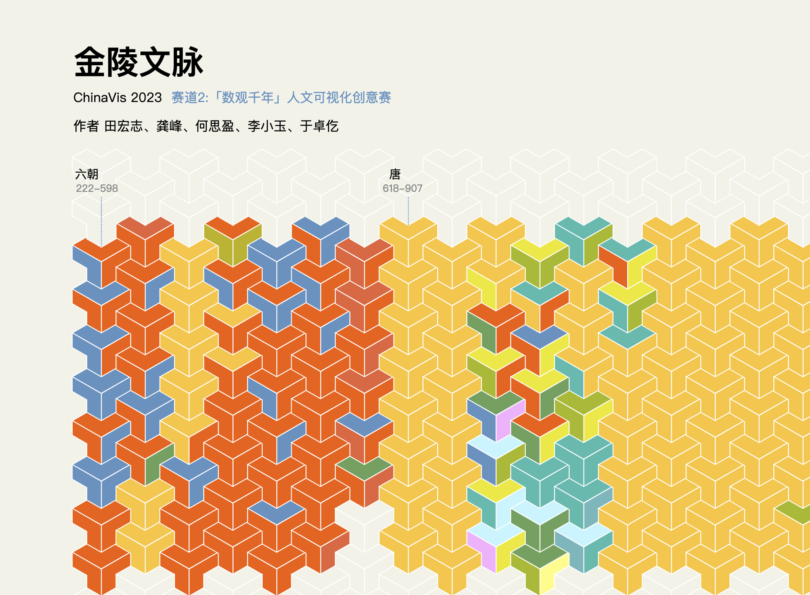
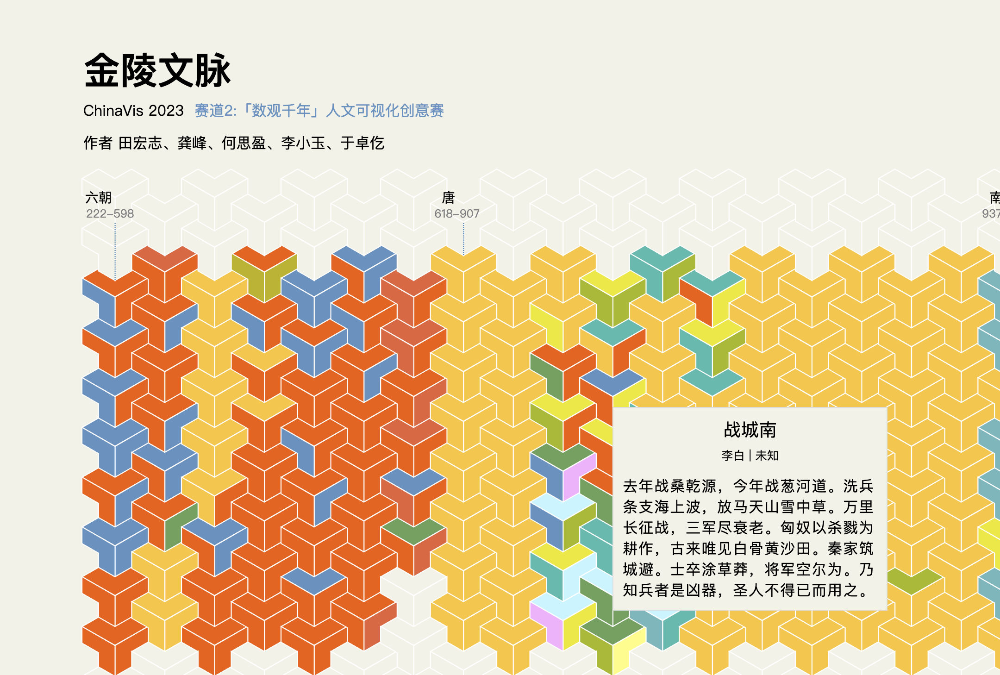

# Jinling-visual

金陵文脉可视化展示 —— ChinaVis 2023「数观千年」人文可视化创意赛（赛道 2）参赛作品。

## 项目简介

本项目以 **944 首与金陵（南京）相关的历朝诗歌** 为数据源，使用 **D3.js** 绘制等距立体方块图，从 **时间（朝代）** 与 **文体** 两个维度展示金陵千年文脉的演变。

- **竞赛**：[ChinaVis 2023 赛道 2「数观千年」](https://chinavis.org/2023/challenge.html)
- **作者**：田宏志、龚峰、何思盈、李小玉、于卓仡

## 效果预览

### 整体视图

等距立体方块按朝代分列排列，不同颜色代表不同诗歌文体。



### 交互详情

点击任意方块，弹出 tooltip 展示诗歌标题、作者、文体与正文。



## 数据概览

| 朝代 | 数量 | 时间范围 |
|------|------|----------|
| 六朝 | 162 | 222–598 |
| 唐 | 264 | 618–907 |
| 南唐 | 74 | 937–975 |
| 宋 | 72 | 960–1279 |
| 元 | 27 | 1271–1368 |
| 明 | 219 | 1368–1644 |
| 清 | 125 | 1616–1912 |
| 当代 | 1 | 1949– |

共涵盖 **19 种** 诗歌文体（五言古体诗、七言律诗、词、乐府诗等）。

## 本地预览

本项目为纯静态前端，需通过 HTTP 服务访问（直接打开 `index.html` 无法加载 JSON 数据）。

### 方式一：Python（推荐）

```bash
cd Jinling-visual
python3 -m http.server 8080
```

浏览器访问 http://localhost:8080

### 方式二：Docker

```bash
docker build -t jinling-visual .
docker run -p 8080:80 jinling-visual
```

浏览器访问 http://localhost:8080

### 方式三：Node.js

```bash
npx serve .
```

> 预览需联网，`index.html` 引用了 CDN 上的 `d3-array` 库。

## 项目结构

```
Jinling-visual/
├── index.html              # 入口页面
├── app.js                  # 核心可视化逻辑
├── style.css               # 样式
├── js/d3.js                # D3 库
├── data/
│   └── jinling_poetry.json # 前端使用的诗歌数据
├── script/                 # 数据预处理脚本（Python）
├── docs/images/            # 效果截图
├── Dockerfile              # Docker 部署
└── nginx.conf              # Nginx 配置
```

## 技术栈

| 层级 | 技术 |
|------|------|
| 前端 | HTML + CSS + JavaScript |
| 可视化 | D3.js |
| 数据处理 | Python（pandas） |
| 部署 | Docker + Nginx |
| CI/CD | GitHub Actions |

## 数据流水线

```
原始 CSV / Excel
    ↓ script/preData.py（合并、采样、排序）
new_data.csv
    ↓ script/data_conversion.py
jinling_poetry.json  →  app.js 加载渲染
```

## 部署

推送到 `dev` 分支后，GitHub Actions 会自动构建 Docker 镜像并部署到远程服务器。

## 引用

- 可视化灵感参考：[古柳 GuLiu 的 D3 等距方块实现](https://observablehq.com)
- 数据来源：[ChinaVis 2023 挑战赛](https://chinavis.org/2023/challenge.html)
- 可视化库：[D3.js](https://github.com/d3/d3)

## License

See [LICENSE](./LICENSE).
